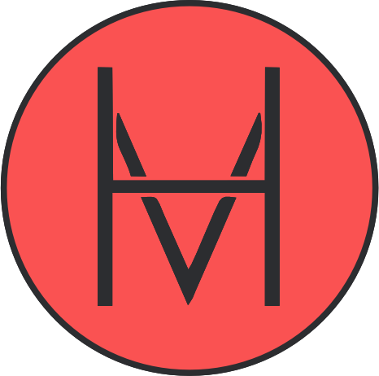

<h1 align="center">Greetings, Internet Traveler!   I’m <a href="https://mahanman.ir">Mahan</a> 🚀</h1>
<h3 align="center">Let's turn ideas into digital reality together! ✨</h3>

<!-- Transforming Ideas into Digital Magic ! -->
CEO & TeamLead in <a href="https://github.com/DamavandIT"> @DamavandIT</a>, With over four years of experience, I blend front-end finesse with back-end expertise, crafting powerful, user-friendly web solutions. Starting my coding journey at 16, I initially focused on creating responsive interfaces before immersing myself in PHP and Laravel. My professional experience spans three years, backed by a solid foundation from Sharif Technology Tower under Sharif University of Technology.

From designing intuitive UIs to building complex trading platforms like FE-26 (PooyaPH), I turn web challenges into seamless solutions. While my strengths lie in back-end development, I’m constantly evolving across the stack. Ready to bring innovative projects to life? Let’s make it happen.

---

<h3 align="left">Social Media:</h3>

<h3 align="left">Currently working with:</h3>

<h3 align="left">Tools:</h3>

<h3 align="left">Currently Learning:</h3>

<h3 align="left">Previously worked with:</h3>

<h3 align="left">Contact Me on:</h3>

**Currently focused on developing:**

- [PooyaPH](https://pooyaph.com/)
- [FE-26](https://FE-26.ir/)
- [Resid-Kala](https://resid-kala.ir/)

